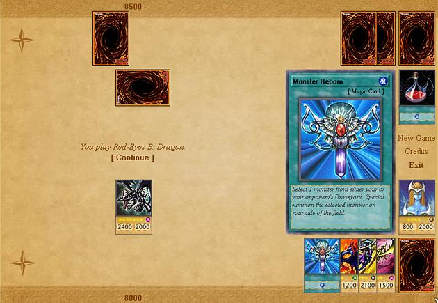



## Monsters Duel \(Trading Card Game\)

### Description

Hi everyone. Monsters Duel is based on the Yu-Gi-Oh card game. It is a single player oriented game were you have to defeat your opponents in order to get more cards. It also includes a deck builder were you can freely rearrange your deck as your wich. I hope you get as much fun as I did creating this game so if you like it please vote for it. If you have any questions, commentaries or suggetions I'm all ears.
 
### More Info
 

             |
---                |---
**Submitted On**   |2004-09-11 12:06:38
**By**             |[Abel Ricaurte](https://github.com/Planet-Source-Code/PSCIndex/blob/master/ByAuthor/abel-ricaurte.md)
**Level**          |Intermediate
**User Rating**    |4.9 (64 globes from 13 users)
**Compatibility**  |VB 6\.0
**Category**       |[Games](https://github.com/Planet-Source-Code/PSCIndex/blob/master/ByCategory/games__1-38.md)
**World**          |[Visual Basic](https://github.com/Planet-Source-Code/PSCIndex/blob/master/ByWorld/visual-basic.md)
**Archive File**   |[Monsters\_D1792239112004\.zip](https://github.com/Planet-Source-Code/abel-ricaurte-monsters-duel-trading-card-game__1-56126/archive/master.zip)

